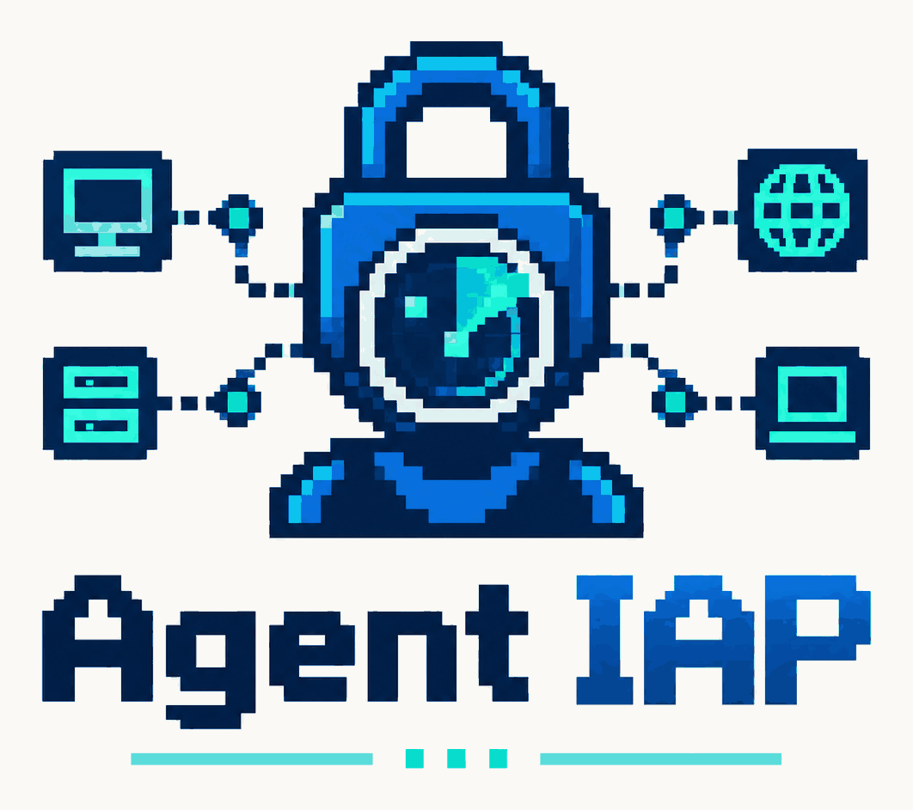
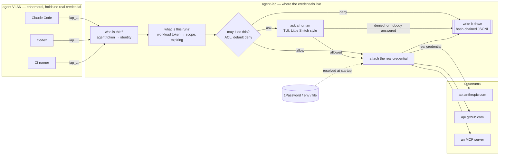
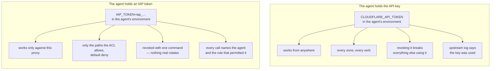
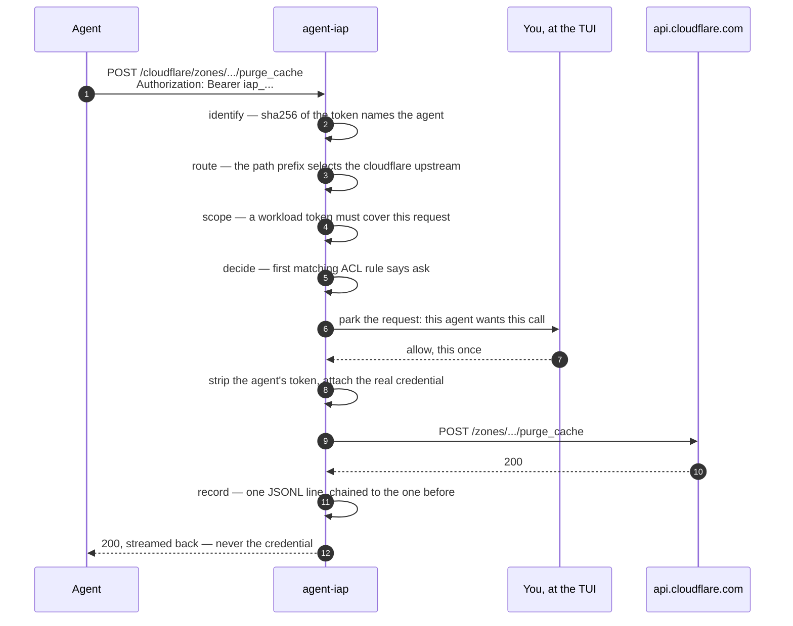

<p align="center">
  
</p>

# agent-iap

[](https://github.com/vpetersson/agent-iap/actions/workflows/ci.yml)
[](https://github.com/vpetersson/agent-iap/releases/latest)

An identity-aware proxy for LLM agents.

**Give an agent access to an API or an MCP server without ever giving it the credential.**
Everything else here — the ACL, the interactive prompt, the tamper-evident audit
log — exists to make that grant narrow, observable and revocable.



The agent holds a token minted by the proxy. It is not an API key, it buys
nothing anywhere else, and revoking it rotates nothing. The real credential is
resolved from 1Password (or the environment, or a file) inside the proxy and
attached on the way out, after the policy has already said yes.

## Why this exists

The setup this was built for: agents run on a VLAN of their own, ephemeral, and
all they can reach is the internet, a model API and a dedicated GitHub account.
Nothing in that VLAN holds a credential worth stealing — which is exactly what
makes it safe to hand an agent a repository and let it work unattended.

That stops working the moment the task is not code. Build a report from Google
Analytics, check a setting in Cloudflare, pull numbers out of a third-party
dashboard, and the agent needs a credential for a system that was never part of
the arrangement. The two usual answers are both bad:

- **Paste the key into the agent.** It is now in an environment, a config file,
  a context window, and whatever got logged on the way past. It works from
  anywhere, it does everything that key can do, it lasts until a human remembers
  to rotate it, and the upstream's own audit log will tell you the key was used
  — not which agent used it. A prompt injection and a stolen laptop are the same
  event from the upstream's point of view.
- **Do it yourself.** The agent stops at the boundary and a human copies numbers
  between tabs, which is the work you were trying to hand over.

The missing piece is not a better vault. It is the answer to a narrower
question: *can this agent, right now, make this one call against this service* —
answered without the agent ever holding the thing that makes the call work.

### What the proxy changes

The agent gets a token minted by the proxy. It is not an API key: it buys
nothing anywhere else, it names one agent, and one command revokes it without
rotating anything real. The credential stays on the proxy's side of the
boundary and is attached on the way out, after policy has already said yes.



So a leaked agent context leaks a token whose entire power is the ACL, and the
blast radius of a compromised agent is that rule set rather than the API key's
own scope. That is the whole argument; § Security model is the same claim with
its limits attached.

### Where it sits

Little Snitch asks a human before an application is allowed to reach the
network. A secrets manager — 1Password, Vault, [OpenBao](https://openbao.org) —
decides who may *read* a credential. This is the join of the two: the secrets
manager's answer is resolved inside the proxy and never handed to the caller,
and the per-connection question Little Snitch asks gets asked per credentialed
call instead, with the answer written down.

It is deliberately none of the following. It is not a secrets manager — it
reads from yours. It is not a firewall — allowing a call is not opening the
network, and the agent VLAN still needs its own rules. It is not a sandbox — it
constrains what an agent can *reach*, never what it can compute.

### How long a grant lasts

Policy is not a clock, and it is not trying to be: a rule is true until you
change it, an `ask` is answered per call, and "remember for this session" dies
with the process. Two things here do expire, and between them they are what
"give it Google Analytics for the next hour" means.

The agent's own credential expires under § Workload identity. The agent trades
its standing token for one scoped to the work actually in front of it, valid for
an hour at most, and once that lapses the copy left behind in a context window
buys nothing. The default mode is `optional`, so until you set `required` the
standing agent token still works and the bound is one the agent opted into —
`required` is what turns it into a bound you imposed.

The credentials the proxy mints *upstream* expire too
(`oauth2_client_credentials`, `service_account_jwt`), on the provider's clock
rather than yours. The agent never sees those at all.

## Install

Every `v…` tag builds a binary for each platform, checksums it, and attaches it
to a GitHub Release — plus a container image on ghcr.io from the same bytes.
Pick whichever suits the box:

```bash
# linux-x86_64 · linux-aarch64 · macos-arm64 · macos-x86_64
v=2026.9.1 platform=linux-x86_64
base=https://github.com/vpetersson/agent-iap/releases/download/v$v

curl -sSfLO "$base/agent-iap-$v-$platform.tar.gz"
curl -sSfLO "$base/SHA256SUMS"
sha256sum --ignore-missing -c SHA256SUMS     # macOS: shasum -a 256 -c

tar xzf "agent-iap-$v-$platform.tar.gz"
sudo install -m0755 "agent-iap-$v-$platform/agent-iap" /usr/local/bin/agent-iap
agent-iap --version
```

The Linux binaries are statically linked against musl: no glibc floor, so the
same file runs on a current Ubuntu and on whatever the box in the rack is
running, and there is no runtime to install beside it. The TLS roots are
compiled in too, so it needs nothing from `/etc/ssl` either. The macOS builds
are not signed or notarised — `curl` sets no quarantine attribute so this works,
but a binary downloaded through a browser needs
`xattr -d com.apple.quarantine agent-iap` first.

Or the image, which is the same binary on a distroless base — no shell, no
package manager, nothing to run but the proxy:

```bash
docker run --rm ghcr.io/vpetersson/agent-iap:2026.9.1 --version
```

Tags are `2026.9.1`, the floating `2026.9` within a month, and `latest` — which
moves only when the tag being built really is the newest one, so a backport does
not walk it backwards. There is no `2026` tag: the year is the major only
because semver needs one (§ Versioning), and a year-wide alias would imply a
promise nothing here makes.
[§ Deployment](#deployment) has what to mount and what the image deliberately
cannot do.

With a Rust toolchain, from source:

```bash
cargo install --locked --git https://github.com/vpetersson/agent-iap
```

`cargo install agent-iap` — the crates.io form — does not work yet: nothing is
published there. The crate packages cleanly and the release workflow already
carries the job, dormant until a `CARGO_REGISTRY_TOKEN` secret exists, because
publishing cannot be undone and is worth deciding on rather than defaulting
into. Until then `--git` is the toolchain path.

## Quickstart

Everything below writes `./iap.toml` in the current directory, so it needs no
root and nothing installed anywhere: this is the proxy on a laptop, in front of
one upstream. [§ Deployment](#deployment) is the same thing as a daemon.

```bash
# 1. Write a policy file. No agents, no upstreams, default deny — it starts a
#    proxy that grants nothing, and mints no credential you did not ask for.
agent-iap init

# 2. Say what it fronts, what is allowed, and who may ask. No editor.
agent-iap upstream add anthropic \
    --base-url https://api.anthropic.com \
    --auth header --header x-api-key --secret env:ANTHROPIC_API_KEY
agent-iap acl add --target anthropic \
    --methods POST --paths /v1/messages
agent-iap agent add claude-code --target anthropic
#    ^ prints the agent's token once. Only its sha256 goes in the file.

# 3. Check the policy and prove every credential reference resolves.
export ANTHROPIC_API_KEY=sk-...            # the key the proxy will inject
agent-iap check --config iap.toml

# 4. See what the policy exposes, and to whom.
agent-iap list --config iap.toml

# 5. Run it. On a terminal that is the approval console.
agent-iap run --config iap.toml
```

Point the agent at the proxy:

```bash
export ANTHROPIC_BASE_URL=http://127.0.0.1:8080/anthropic
export ANTHROPIC_AUTH_TOKEN=iap_...        # the token from step 2, not your API key
```

Or, for an agent rather than an SDK, give it the proxy as an MCP server and let
it discover the rest — what it can reach, and how to call it, come back from the
policy itself. See § MCP:

```json
{ "mcpServers": { "iap": {
    "type": "http",
    "url": "http://127.0.0.1:8080/_iap/mcp",
    "headers": { "Authorization": "Bearer iap_..." } } } }
```

`init` writes the proxy and nothing else, on purpose: a starter file that
guesses at an upstream is a file you have to read before you can trust it, and a
token minted for an agent you may never create is a live credential sitting in
your scrollback with nobody knowing to revoke it. Everything else is added by
the command that names it, and each edit is validated against the same schema
the proxy loads before it is saved — a rejected flag leaves the file untouched.

If you would rather start from something already filled in, two templates do:

```bash
agent-iap init --template starter                      # one agent, Anthropic, one rule
agent-iap init --template full --agent claude-code     # the annotated example, every pattern
agent-iap init --force                                 # replace an existing file
```

`--template full` carries its own copy of `iap.example.toml`, so it works from an
installed binary with no checkout.

For a service that already has a profile, step 2 is one command that writes the
upstream *and* its rules — see [§ Profiles](#profiles):

```bash
agent-iap profile add cloudflare --secret op://Private/Cloudflare/token
```

The enrolment commands compose the same way for everything else:

```bash
agent-iap upstream add github --base-url https://api.github.com \
    --auth bearer --secret op://Private/GitHub/token
agent-iap acl add --agent 'ci-*' --target github --methods GET --paths '/repos/**'
agent-iap acl add --target github --methods DELETE --paths '/**' --action ask
agent-iap agent add ci-runner --name "CI" --target github
```

Rules are **appended**, never inserted, because first match wins — a new rule can
never silently shadow one already in the file, and `acl add` prints the position
it landed in. `agent add --target` refuses a target that names no upstream or MCP
server: that mistake leaves a file that is valid, an agent that looks scoped, and
every one of its calls denied by a rule that never mentions it.

Each of those has an `rm` — see [§ Revoking and removing](#revoking-and-removing),
which is the command you want at 2am rather than an editor.

`agent-iap gen-token <id>` still prints an `[[agents]]` block to paste, for the
cases where the policy file is generated by something other than this CLI.

```
┌────────────────────────────────────────────────────────────────────────────────────────────────────────────┐
│ agent-iap   proxy 127.0.0.1:8080    1 waiting    1 agents · 1 upstreams · 0 mcp · 1 rules · default deny    │
└────────────────────────────────────────────────────────────────────────────────────────────────────────────┘
┌ waiting for you ───────────────────────────────┐┌ request ─────────────────────────────────────────────────┐
│▶    4s Claude Code github POST /repos/acme/api/││   agent  Claude Code (claude-code)                       │
│                                                ││    kind  http                                            │
│                                                ││  target  github                                          │
│                                                ││  method  POST                                            │
│                                                ││    path  /repos/acme/api/issues                          │
│                                                ││ waiting  4s                                              │
│                                                ││                                                          │
│                                                ││The credential is never shown to the agent — allowing only│
│                                                ││lets this one call through.                               │
└────────────────────────────────────────────────┘└──────────────────────────────────────────────────────────┘
┌ audit log (live) ──────────────────────────────────────────────────────────────────────────────────────────┐
│06:04:13 allow                  claude-code github GET /repos/acme/api → 200  [github-reads]                │
└────────────────────────────────────────────────────────────────────────────────────────────────────────────┘
┌────────────────────────────────────────────────────────────────────────────────────────────────────────────┐
│ ↑/↓  move   a  allow   A  allow for session   d  deny   D  deny for session   f  forget   q  quit           │
└────────────────────────────────────────────────────────────────────────────────────────────────────────────┘
```

## Profiles

For a service someone has already worked out, `profile add` writes the whole
thing — base URL, credential scheme, OAuth scopes and a set of rules narrow
enough to be worth calling a policy:

```bash
agent-iap profile list
agent-iap profile show graylog
agent-iap profile add graylog --secret op://Private/Graylog/token \
    --var host=graylog.example.com:9000
```

That last command knows three things you would otherwise have to look up:
Graylog's API hangs off `/api`, it authenticates an access token as basic
`<token>:token` with the *token in the user field*, and its searches are POSTs
so a GET-only "read" level cannot read anything. Getting any of those wrong
fails late — a 401 with no detail, or a rule that quietly grants more than you
meant.

`--secret` is the same credential reference every other command takes, and
`profile add` never asks for a credential itself. `--dry-run` prints the exact
TOML it would append and writes nothing, because a policy you have not read is
not a policy you can rely on.

| Flag | |
| --- | --- |
| `--as <name>` | name it something else — this is how one proxy fronts two accounts of the same service |
| `--access <level>` | which bundle of scopes and rules; defaults to the narrowest the profile has |
| `--var name=value` | what is yours rather than the vendor's: a self-hosted host, a region, an API login |
| `--agent <id>` | scope the rules to one agent instead of all of them |
| `--dry-run` | print, do not write |

Access levels are per profile and `profile show` lists them. They differ in
scopes as well as paths, which is the part that is easy to get wrong by hand:
Search Console's `read` asks Google for `webmasters.readonly` and its `write`
asks for `webmasters`, and no amount of ACL gets a `readonly` token to submit a
sitemap.

Two levels are worth knowing about because they exist for reasons that are not
about permissions:

- **`cloudflare --access ask-writes`** allows GET, denies DELETE outright, and
  parks everything else for a human. The ACL cannot tell a reasonable POST from
  a destructive one; this is where `ask` earns its place.
- **`dataforseo`** defaults to a level that allows the queued endpoints and makes
  the `live` ones prompt. Nothing in the method or the path says one costs more
  than the other, and an agent has no way to know.

### What is in the catalog

Everything the profiles cover is reachable without them — a profile is a
starting point that writes ordinary TOML, not a special case in the proxy.

| Vendor | Profiles |
| --- | --- |
| Google | `google-search-console`, `google-analytics-data`, `google-analytics-admin`, `google-indexing`, `google-bigquery`, `google-drive`, `google-sheets`, `google-cloud-logging`, `google-cloud-storage` — all one service account, all `service_account_jwt` |
| Cloudflare | `cloudflare` (the whole `client/v4` surface), plus `cloudflare-mcp-*` for each of the sixteen hosted MCP servers |
| PostHog | `posthog` (REST), `posthog-mcp` |
| DataForSEO | `dataforseo`, `dataforseo-mcp` |
| Graylog | `graylog` |
| Others | `anthropic`, `openai`, `github`, `linear`, `sentry`, `slack`, `stripe` |

`agent-iap profile list --output json` for a machine, `--vendor google` to narrow
it.

Two honest limits, both printed by `profile show`:

- **Cloudflare's hosted MCP servers speak OAuth, not API tokens.** The
  `cloudflare-mcp-*` profiles therefore run them through `npx mcp-remote`, which
  does the browser flow and caches the grant. The proxy still rules on and logs
  every JSON-RPC message, but the credential lives in the child's cache rather
  than in the proxy. For a credential the proxy actually holds, the `cloudflare`
  REST profile covers the same services.
- **Tool catalogs move.** PostHog exposes well over a thousand tools, so its
  `read` level allows the read verbs and sends everything else to `ask` rather
  than denying it. Watch the audit log for `ask` rows and promote the ones you
  want.

## Enrolling anything else

The enrolment commands cover every scheme the proxy supports, including the two
that mint a token rather than forwarding a secret:

```bash
# A Google service account, no editor and no JSON key in the file.
agent-iap upstream add gsc --base-url https://searchconsole.googleapis.com \
    --auth service-account-jwt --key-file op://Private/GCP/credential \
    --scope https://www.googleapis.com/auth/webmasters.readonly

# An API whose *user* field is the credential.
agent-iap upstream add graylog --base-url https://graylog.example.com/api \
    --auth basic --username-secret op://Private/Graylog/token --secret literal:token

# MCP servers, remote and local.
agent-iap mcp-server add posthog --url https://mcp.posthog.com/mcp \
    --auth bearer --secret op://Private/PostHog/key
agent-iap mcp-server add notes --command notes-mcp --arg --stdio \
    --env NOTES_TOKEN=op://Private/Notes/token
```

`--username-secret` is for the APIs that put the credential in the user half of
basic auth — Graylog's `<token>:token`, and its session-token variant. Spelling
that with a plain `--username` would mean the token itself living in a file
meant to be committable, so the user field takes a reference and the password
takes the scheme's documented constant. That constant is the one `literal:`
the loader does not complain about, and only in that position: a `literal:` in
`--username-secret` is still refused.

### Revoking and removing

Every enrolment has an inverse, and the one that matters is the one you run at
2am:

```bash
# A token leaked. Mint the agent a new one, print it once, keep the id.
agent-iap agent rotate ci-runner

# Or retire the agent outright, taking the rules that named it.
agent-iap agent rm ci-runner --prune

agent-iap upstream rm github --prune     # also drops it from agents' `targets`
agent-iap mcp-server rm notes --prune
agent-iap acl rm 3                       # the `#` column of `agent-iap list acl`
```

`rotate` is the leaked-token path: a new token, the same agent id, and an audit
log that still reads as one agent rather than two. It refuses an agent whose
`token_ref` points into 1Password or a file — the token lives there, so that is
where it rotates.

A removal is validated exactly as an add is, so it cannot leave a file the proxy
would refuse to load: `upstream rm` will not strand a `targets` entry that names
it, and `--prune` will not empty an agent's `targets` altogether, because empty
means *any* target rather than none. A removal must not widen a grant on its way
past.

Without `--prune`, whatever named the removed thing stays and is printed by
number, so a rule matching nothing is something you were told about rather than
something you find later. Only rules that name it *outright* are pruned:
`agent = "ci-*"` covers a fleet, and one member leaving is not that rule ending.

**None of it takes effect until the proxy restarts.** There is no hot reload
(§ Multiple agents), so a rotated token is not yet a revoked one — every one of
these commands says so, and the leaked token keeps working until the process
comes back.

## What happens to a request



1. **Identify.** The agent sends `Authorization: Bearer <iap-token>` (or
   `X-IAP-Token`). Only the token's sha256 is stored in the policy file. If it
   sends a workload token instead — see § Workload identity — that is checked,
   and it also says what this particular run asked to be able to do.
2. **Route.** `POST /anthropic/v1/messages` selects the `anthropic` upstream and
   forwards `/v1/messages`. `X-IAP-Upstream: anthropic` does the same without a
   path prefix, for SDKs that will not take one.
3. **Scope.** A workload token covers a list of requests. Anything outside it is
   refused here, before policy is consulted at all.
4. **Decide.** The first matching ACL rule wins. Nothing matched means the
   default applies, and the default is `deny`.
5. **Ask, if the rule says so.** The request is parked and the operator answers
   it. A timeout, or no one watching the queue, denies.
6. **Inject.** The agent's own token is stripped. The real credential is added.
7. **Record.** One JSON line: who, what, which rule decided, the status, how long
   it took. Then the response is streamed straight back — token-by-token
   responses stay token-by-token.

### The approval console

`agent-iap run` *is* the console. Step 5 parks a request until a human answers
it, and the one thing that must never happen is parking it in a queue nobody is
looking at — so the console is what `run` opens wherever there is a terminal to
draw it on, and no flag asks for it:

```bash
agent-iap run                             # the console, on a terminal
agent-iap run --no-tui                    # the log stream on stderr instead
agent-iap run --tui                       # insist, for a terminal we did not recognise
```

Where there is no terminal — a unit file, a container, a pipe into `tee` —
`run` is the log stream it has always been, so nothing already deployed has to
learn a flag. What it gives up is the keyboard: unless something is polling the
control plane, an `ask` denies immediately rather than parking, and the startup
banner says which of the two you are getting.

The console owns the terminal, so diagnostics go to `agent-iap.log` beside the
audit log instead of to stdout, and the bottom pane is a live tail of the audit
log — what the agent has been doing while you decide what to allow next.
`↑`/`↓` moves, `a`/`d` answers, `A`/`D` answers and remembers it for this
session, `f` forgets what was remembered, and `q` quits the console and stops
the proxy with it.

## The policy file

`agent-iap init` writes one; `iap.example.toml` is the commented walk-through it
embeds under `--template full`. The shape:

```toml
[[agents]]
id = "claude-code"
name = "Claude Code"
token_sha256 = "…"                  # from `agent-iap gen-token`
targets = ["anthropic", "github"]   # optional hard scope, checked before the ACL

[[upstreams]]
name = "anthropic"
base_url = "https://api.anthropic.com"
auth = { type = "header", header = "x-api-key", secret = "op://Private/Anthropic/credential" }

[[acl]]
name = "anthropic-inference"        # this name appears in every audit record
agent = "claude-code"
kind = "http"                       # http | mcp | *
target = "anthropic"
methods = ["POST"]
paths = ["/v1/messages"]
action = "allow"                    # allow | deny | ask

[acl_default]
action = "deny"
```

An `[[mcp_servers]]` block has the same shape, and `agent-iap mcp-server add`
writes one. Both it and `upstream add` take every credential scheme below.

`*` and `**` are globs. In `paths`, `*` stops at `/` and `**` crosses it, so
`/repos/*` does not silently grant everything under `/repos`. Unknown keys are a
hard error — a typo must never quietly widen access.

### Credential schemes

| `type` | Effect |
| --- | --- |
| `bearer` | `Authorization: Bearer <secret>` |
| `header` | any header, with an optional `prefix` |
| `basic` | `Authorization: Basic base64(username:secret)`, or `username_secret` when the *user* field is the credential |
| `query` | appends `?param=<secret>` |
| `oauth2_client_credentials` | fetches and caches an access token, refreshed a minute before expiry |
| `service_account_jwt` | signs a JWT with a service-account key and exchanges it for a short-lived token — see below |
| `none` | pass through |

The last two mint a token rather than forwarding a secret. Minted tokens are
cached until a minute before they expire, and a burst of requests on a cold
cache mints one token, not one each.

### Service accounts (Google, and anything else doing RFC 7523)

Google does not want you sending a service-account key to an API. It wants a
JWT, signed with that key, exchanged at its token endpoint for an access token
that lives an hour. The proxy does all of that — the agent never sees the key,
and never sees the access token either.

```toml
[[upstreams]]
name = "gcs"
base_url = "https://storage.googleapis.com"

[upstreams.auth]
type = "service_account_jwt"
key_file = "op://Private/GCP Service Account/credential"   # the JSON Google gave you
scopes = ["https://www.googleapis.com/auth/devstorage.read_only"]
# subject = "person@example.com"   # domain-wide delegation: act as this user
```

`key_file` points at the service-account JSON exactly as Google issues it; the
issuer, key id and token endpoint all come from inside it. For any other
provider that accepts a signed assertion, spell the pieces out instead:

```toml
[upstreams.auth]
type = "service_account_jwt"
issuer = "service@example.com"
private_key = "file:/run/secrets/service-account.pk8.pem"   # PKCS#8 PEM
token_url = "https://auth.example.com/oauth/token"
audience = "https://api.example.com"    # defaults to token_url, which is what Google wants
scopes = ["read:data"]
lifetime_secs = 3600                    # clamped to an hour, Google's ceiling
```

The key is parsed at startup, so a malformed or passphrase-encrypted key stops
the process with a message naming the problem rather than turning into a 502 on
the first call. PKCS#1 keys (`BEGIN RSA PRIVATE KEY`) are rejected with the
`openssl` command that converts them. Every mint is recorded in the audit log
with the issuer, scopes and expiry — never the token.

### Timeouts

`upstream_timeout_secs` (default 300) is an **idle** timeout — the longest an
upstream may go silent mid-response. A token-by-token LLM response can stream for
as long as it likes provided it keeps arriving. `upstream_connect_timeout_secs`
(default 30) bounds establishing the connection.

### Listening addresses

`server.listen` is where agents connect; `server.admin_listen` is the control
plane the TUI and the MCP bridge use. Both live in the policy file, and both can
be overridden at run time by a deployment that does not own that file:

```bash
agent-iap run --listen 0.0.0.0:8080       # full address
agent-iap run --listen 9000               # bare port: keeps the configured interface
agent-iap run --admin-listen off          # no control plane, so no MCP bridge and no curl
IAP_LISTEN=0.0.0.0:8080 agent-iap run     # same, for a container or a unit file
```

A flag beats `IAP_LISTEN` / `IAP_ADMIN_LISTEN`, which beat the file. A bare port
moves the port and never the interface — `--listen 9000` against a loopback
config stays on loopback — because a process holding live credentials should
reach every interface only when someone spells that out. The proxy and the
control plane may not share an address; that is rejected at startup rather than
arriving later as whichever bind happened to lose.

### Where secrets come from

`op://vault/item/field` (1Password CLI), `env:NAME`, `file:/path`, and
`literal:…` for demos — which the loader warns about. Everything is resolved at
startup, so a locked vault fails the process rather than the tenth request.
A bare value that is not one of these forms is rejected, and the error never
echoes what you pasted.

### TLS

`[server.tls]` puts the proxy on HTTPS. Absent, it speaks plain HTTP exactly as
before, so nothing existing changes by upgrading.

```toml
[server.tls]
cert = "file:/etc/agent-iap/fullchain.pem"     # PEM chain, leaf first
key  = "op://Infra/agent-iap tls/private key"  # PEM key: PKCS#8, PKCS#1 or SEC1
ca   = "file:/etc/agent-iap/root_ca.crt"       # optional: the CA that signed it
```

All three are *references*, resolved the same way every other credential is — a
key is a credential, and this file stays safe to commit. All three are resolved
**and parsed** at startup, before anything binds: a mismatched pair, a malformed
PEM or a locked vault stops the process, rather than coming up healthy and
failing the first handshake. `agent-iap check` runs the same load.

`ca` is for the one client this project runs itself — `agent-iap mcp`, dialling
the control plane. Public CAs need nothing here. A private CA wants its root
named, so the trust anchor is the CA rather than whatever the served chain
happens to contain. Leave it out and the bridge falls back to verifying against
`cert` itself, which is exactly right for a self-signed certificate and is what
every existing config does today. It buys agents nothing: they are other
processes on other hosts, and they get the root the way they get everything
else — see § Small Step below.

The control plane follows the proxy onto TLS without being named twice — it
carries the admin token and is no less sensitive. Give it a certificate of its
own only if it needs one:

```toml
[server.admin_tls]
cert = "file:/etc/agent-iap/admin-fullchain.pem"
key  = "file:/etc/agent-iap/admin-key.pem"
ca   = "file:/etc/agent-iap/root_ca.crt"
```

The listener offers ALPN `h2` and `http/1.1`, so an agent that speaks HTTP/2
keeps speaking it. Versions and cipher suites are rustls's defaults and there is
no knob for them: a policy file that can select TLS 1.0 is a liability.

The MCP bridge reads the same policy file, so `agent-iap mcp` finds the control
plane on `https://` by itself and verifies it against `ca`, or against `cert`
when there is no `ca` — a self-signed loopback certificate needs no extra step,
and verification is never turned off in either case. Which is why the
certificate the control plane serves has to name the address it is reached at;
see below.

Renewal still means a restart; there is no reload yet. Client certificates are
not an identity here either — agents are still the bearer token.

#### Where the certificate comes from

Nothing above is provider-specific. `cert` and `key` are a PEM chain and a PEM
key, and `ca` is a PEM bundle, so ACME, an internal CA, a corporate PKI or a
certificate someone handed you on a USB stick all work identically — the proxy
never asks who signed it. If your company already runs a CA, that is the
provider, and this section is only what someone else's commands look like.

Two are worth writing down, because between them they are the two shortest paths
from "loopback only" to "an agent on another host", and they differ on the one
thing that actually costs you anything: who has to be told to trust the result.

| | Tailscale | Small Step (`step-ca`) |
| --- | --- | --- |
| Signed by | Let's Encrypt, via Tailscale — a public root | a CA you run |
| Clients need a CA certificate | no, the system trust store already has it | yes, your root, on every host an agent runs on |
| `ca` in the policy file | leave it out | name your root |
| The name it is valid for | `host.tailnet-name.ts.net`, not yours to choose | whatever you issue for |
| Lifetime | 90 days | 24 hours by default, and yours to set |
| Also answers | how the agent reaches the host at all | nothing — bring your own network |

Tailscale is the one to reach for when you want an agent off this host talking
to the proxy this afternoon: the certificate is trusted everywhere with no
client-side step at all, and the tailnet disposes of the separate question of
how an agent on a laptop reaches a proxy in a rack. Small Step is the one that
looks like the rest of a company's internal x509 — you run the CA, you set the
lifetimes and the naming, and every client is pointed at your root. That extra
step is the whole difference, and it is also the reason the second one scales to
things other than this proxy.

A self-signed certificate is a third path and a legitimate one for a single
host. It costs the same client-side work as a private CA — every agent must be
given the certificate — while buying none of the CA's reach, so it is worth it
for one machine and stops being worth it at two.

#### Tailscale

Enable HTTPS for the tailnet once, in the admin console under **DNS → HTTPS
Certificates**, then on the host that runs the proxy:

```bash
# The machine's own MagicDNS name; `tailscale status` prints it.
sudo tailscale cert \
  --cert-file /etc/agent-iap/fullchain.pem \
  --key-file  /etc/agent-iap/key.pem \
  iap.tailnet-name.ts.net
```

```toml
[server]
listen = "100.x.y.z:8080"     # the tailnet address — see below

[server.tls]
cert = "file:/etc/agent-iap/fullchain.pem"
key  = "file:/etc/agent-iap/key.pem"
```

No `ca`: Let's Encrypt is already in every trust store there is.

Agents use `https://iap.tailnet-name.ts.net:8080` and need nothing else: the
chain ends at a public root, so `curl`, `requests` and `node` verify it with no
configuration, no `--cacert` and no bundle to distribute. That is the entire
argument for this option.

Bind `listen` to the tailnet address rather than `0.0.0.0`. The certificate is
valid for the `ts.net` name only, so a LAN client gets a name mismatch rather
than a connection — and the process holding every upstream credential has no
reason to be accepting connections on an interface whose callers it cannot even
serve.

The certificate lasts 90 days. Re-running the same `tailscale cert` command
renews it, and since the proxy reads both files once at startup, the renewal and
the restart belong in one unit:

```bash
tailscale cert --cert-file /etc/agent-iap/fullchain.pem \
               --key-file  /etc/agent-iap/key.pem \
               iap.tailnet-name.ts.net \
  && systemctl restart agent-iap
```

#### Small Step

`step-ca` issues from a CA you run, which is the arrangement most companies
already have for internal services. With a CA up and this host bootstrapped
against it (`step ca bootstrap --ca-url … --fingerprint …`):

```bash
# Writes the leaf first and then the intermediate, which is the order `cert` wants.
step ca certificate iap.internal.example.com \
  /etc/agent-iap/fullchain.pem /etc/agent-iap/key.pem

# The root every agent will have to trust.
step ca root /etc/agent-iap/root_ca.crt
```

```toml
[server.tls]
cert = "file:/etc/agent-iap/fullchain.pem"
key  = "file:/etc/agent-iap/key.pem"
ca   = "file:/etc/agent-iap/root_ca.crt"
```

`step ca certificate` writes the leaf *and* the issuing intermediate into the
crt file — that is what step-ca returns, and `cert` wants exactly it, because
the intermediate is what lets an agent build a path from the leaf to your root.
Serving a bare leaf you extracted from that file is the mistake to avoid.

`ca` is separate and is about verifying rather than serving: it names the root
that `agent-iap mcp` checks the control plane against. Without it the bridge falls
back to treating the served chain as its own anchor, which works by coincidence
— the intermediate happens to be in there — and stops working the moment
someone splits the file or a provider hands over a leaf on its own. Naming the
root says which certificate is the trust anchor instead of inferring it from
whatever was bundled.

Then the half Tailscale does not have, and the one `ca` does not help with:
`ca` is read by this process, and agents are other processes on other hosts.
Every host an agent runs on needs the root, by whichever of these the client
reads:

```bash
curl --cacert /etc/agent-iap/root_ca.crt https://iap.internal.example.com:8080/…

export SSL_CERT_FILE=/etc/agent-iap/root_ca.crt        # curl, and most of C
export REQUESTS_CA_BUNDLE=/etc/agent-iap/root_ca.crt   # python-requests
export NODE_EXTRA_CA_CERTS=/etc/agent-iap/root_ca.crt  # node

# Or install it once into the host's trust store and let every client find it:
step certificate install /etc/agent-iap/root_ca.crt
```

The failure mode to plan for is an agent that cannot verify and is "fixed" with
`curl -k` or `verify=False`. That agent is now handing its bearer token to
whatever answers the address, which is the attack TLS was added here to stop —
so ship the root with the agent's image or its config, and treat a verification
failure as a deployment bug rather than a flag to add.

`step-ca` issues short certificates on purpose — 24 hours by default, and the
provisioner caps what you may ask for. That is a virtue everywhere except here,
where a renewal costs a restart. `step ca renew` can own both ends of it:

```bash
step ca renew --daemon \
  --exec "systemctl restart agent-iap" \
  /etc/agent-iap/fullchain.pem /etc/agent-iap/key.pem
```

#### The control plane's certificate has to match the address

The control plane inherits `[server.tls]` when `[server.admin_tls]` is absent,
and that is usually what you want — but it is *reached* at `admin_listen`, which
is `127.0.0.1:8081`. A certificate issued for `iap.tailnet-name.ts.net` or
`iap.internal.example.com` is not valid for `127.0.0.1`, and `agent-iap mcp` dials
the address from the policy file. It trusts the certificate that file names and
still checks the name against it — verification is never turned off — so the
mismatch surfaces as a refused handshake, not a quiet downgrade.

Give the control plane a certificate that names the address it is actually
reached at:

```bash
step ca certificate localhost --san localhost --san 127.0.0.1 \
  /etc/agent-iap/admin-fullchain.pem /etc/agent-iap/admin-key.pem
```

```toml
[server.admin_tls]
cert = "file:/etc/agent-iap/admin-fullchain.pem"
key  = "file:/etc/agent-iap/admin-key.pem"
ca   = "file:/etc/agent-iap/root_ca.crt"
```

Tailscale cannot issue that one — it signs `ts.net` names only — so a proxy
fronted by Tailscale wants a separate `step-ca` or self-signed certificate for
its control plane. The alternative is `--admin-url https://…ts.net:8081` against
an `admin_listen` on the tailnet address, which moves the admin token onto the
tailnet to save a certificate. Prefer the certificate.

## What is exposed

`check` validates; `list` inventories. At twenty service accounts and MCP servers
on one proxy, "what does this thing front, and with whose credential?" is its own
question, and the answer is one row per thing rather than a comma-joined line.

```console
$ agent-iap list upstreams
NAME       BASE URL                        AUTH                 CREDENTIAL
anthropic  https://api.anthropic.com       header x-api-key     op://Private/Anthropic API/credential
gcs        https://storage.googleapis.com  service_account_jwt  op://Private/GCP Service Account/credential
github     https://api.github.com          bearer               op://Private/GitHub/token
```

`agent-iap list` alone prints every section; `agents`, `upstreams`, `mcp` and `acl`
narrow it to one. ACL rules keep their position in the file, because first match
wins and that order *is* the policy.

The question that actually matters once there is more than one agent is what a
single one of them can reach — `targets` and the ACL intersected:

```console
$ agent-iap list --agent ci-bot
Everything `ci-bot` can address. Rules are in match order — first match wins.

UPSTREAMS
NAME    BASE URL                AUTH    CREDENTIAL                 RULES
github  https://api.github.com  bearer  op://Private/GitHub/token  2
stripe  https://api.stripe.com  bearer  op://Private/Stripe/key    none
```

`RULES` counts the rules that could ever reach that target as this agent, so
`none` is the interesting value: `stripe` is in the agent's `targets`, which
reads like a grant, but no rule names it — every call falls through to the
default and is denied.

`--output json` gives the same inventory for a fleet that gets inventoried by
something other than a human. This reads only the policy file: it needs no
running daemon, it never contacts 1Password, and it prints credential
*references*, never a resolved secret. A `literal:` reference is the credential
rather than a pointer to one, so it prints as `literal:***`.

## Multiple agents

One proxy fronts many agents. That is the shape this is built for — the agents
are the tenants, the upstream credential is the shared thing they are kept away
from, and the policy file is where the difference between them is written.

```toml
[[agents]]
id = "claude-code"
token_sha256 = "…"

[[agents]]
id = "ci-runner"
token_sha256 = "…"
targets = ["github"]                # hard scope, checked before the ACL

# No `agent` key: this rule is every agent, including ones added later.
[[acl]]
target = "anthropic"
methods = ["POST"]
paths = ["/v1/messages"]
action = "allow"

# `agent` is a glob, so one rule can cover a fleet.
[[acl]]
agent = "ci-*"
target = "github"
methods = ["GET"]
paths = ["/repos/**"]
action = "allow"
```

Each agent has its own token; the file holds only hashes, and two agents sharing
a token is a startup error rather than a puzzle later. Every audit record names
the agent that caused it, so one interleaved log still answers per-agent
questions:

```bash
agent-iap audit tail --agent ci-runner
agent-iap audit tail --agent ci-runner --target github

# `-f` follows, and the filter applies to the live stream too — one terminal
# per agent while a run is in flight.
agent-iap audit tail -f --agent ci-runner
```

Approvals are per agent too: a "remember for this session" answer is keyed by
the agent *and* the exact request, so releasing a call for one agent never
releases the same call for another.

Agents off this host need `[server.tls]`; without it their tokens are on the
wire in cleartext, and this is the process holding every upstream credential.

What this does **not** do yet, and all three matter more as the agent count grows:

- **A renewed certificate means a restart.** `[server.tls]` is read once, at
  startup — see § TLS — so every renewal costs the same outage the next bullet
  describes.
- **Changing the roster means a restart.** There is no reload: adding an agent,
  or revoking a leaked token, restarts the process and takes every other agent's
  in-flight request and MCP session with it. At one agent that is free. At
  twenty it is an outage. Every `rm` and `rotate` says so on the way out, because
  a revocation that has not taken effect yet is worse than one you know is
  pending.
- **No per-agent limits.** No rate limit, no concurrency cap, no spend budget.
  The agents share one upstream credential and therefore one quota and one bill,
  and one runaway agent is felt by all of them — the audit log will tell you
  which one, afterwards.

## Workload identity

An agent token answers *who is calling*. It is long-lived, it is the same
credential for every call that agent will ever make, and it says nothing about
what any particular piece of work needs — so a copy of it, lifted out of a
context window or a crash dump, is the agent's whole standing grant until
somebody notices and rotates it.

A **workload token** answers the other half: *what is this run allowed to do,
and until when*. The agent presents its agent token once, says which requests it
needs, and gets back a JWT this proxy signed that expires on its own and covers
nothing else.

```bash
# Exchange the standing credential for an hour of exactly what this run needs.
curl -s localhost:8080/_iap/token \
  -H "Authorization: Bearer $IAP_TOKEN" \
  -H 'content-type: application/json' \
  -d '{
        "workload": "nightly-summariser",
        "scope": [{ "target": "anthropic", "methods": ["POST"], "paths": ["/v1/messages"] }]
      }'
{
  "token": "eyJhbGciOiJFZERTQSIs…",
  "token_type": "Bearer",
  "expires_in": 3600,
  "lineage": "3f7c…", "generation": 0,
  "scope": [ … ]
}

# …and use it exactly where the agent token used to go.
curl -s localhost:8080/anthropic/v1/messages -H "Authorization: Bearer $WORKLOAD_TOKEN" …
```

Turn it on in the policy file:

```toml
[server.workload_identity]
mode = "required"      # off | optional | required
lifetime_secs = 3600   # ceiling as well as default; 60s–3600s
```

`optional` is the default and accepts either credential, so a fleet migrates
without a flag day — the audit log's `workload` field is empty for the calls
still running on a standing grant, which is how you tell when the migration is
finished. `required` is the posture worth landing on: the data plane takes
workload tokens only, and the agent token becomes a bootstrap credential whose
single remaining power is asking for one.

### The three properties

- **A scope can only narrow.** The ACL still runs on every request. The token
  says what the workload asked for; policy says what it may have; a call needs
  both. A minted token can never reach something the policy does not allow, and
  a rule you delete stops working immediately rather than at expiry. That is
  also why minting is not an approval step: asking for a wide scope gets you a
  wide token and exactly the same set of allowed calls.
- **Renewal rotates.** `POST /_iap/token/renew` issues the next token in the
  lineage and retires the one that asked, in the same step. There is never a
  moment when two tokens in a lineage are live. A renewal may re-scope — that is
  the point of renewing rather than holding — and the new scope goes through the
  same checks the mint did, so an agent that lost a target in the meantime does
  not keep it by renewing.
- **Using a superseded token kills the lineage.** Either the workload raced its
  own renewal or somebody else is holding a copy, and from the proxy those are
  the same event. Both end the same way: the lineage is revoked, the log says
  `token_replayed`, and the agent has to come back to the mint. Renew *before*
  the token is on the wire in parallel, and this never fires.

`POST /_iap/token/revoke` ends a lineage early — the honest end of a finished
workload — and `GET /_iap/token` says what the token in your hand covers. All
four endpoints are on the control plane too, without the `_iap` prefix, because
the MCP bridge only ever sees that listener.

The signing key is generated per process and never leaves it; nothing is
persisted. A restart invalidates every outstanding token, which for a credential
measured in minutes is the right failure mode — the agents re-mint and carry on.

### What it costs

Two extra round trips an hour per workload, and an agent that has to handle a
401 by minting again. In exchange, the credential sitting in an agent's memory
for the next hour is worth an hour of one upstream's `/v1/messages` rather than
everything that agent is allowed to do, forever.

The MCP bridge does this on its own: when the daemon reports `workload_identity`
on `/health`, `agent-iap mcp --server github` exchanges its agent token for one
scoped to `github` alone, renews it two minutes before it lapses, and keeps the
agent token for nothing but asking again.

## MCP

Two things share the name here and point in opposite directions.

- **The gateway** makes *agent-iap itself* an MCP server. An agent gets the REST
  APIs this proxy fronts as tools, plus skills generated from the policy that is
  actually running. This is the default way to hand an agent an API.
- **The bridge** points the other way: it fronts somebody else's MCP server, the
  way an upstream fronts somebody else's REST API.

### The gateway

The HTTP proxy is the right surface for a program: point an SDK at
`http://127.0.0.1:8080/<upstream>` and it works unchanged. It is the wrong one
for an agent, which has to be told out of band that the proxy exists, what it
fronts and what it will refuse — none of which is discoverable from a base URL.
MCP is the idiom agents already discover, so the same upstreams are offered over
it:

```json
{ "mcpServers": { "iap": {
    "type": "http",
    "url": "http://127.0.0.1:8080/_iap/mcp",
    "headers": { "Authorization": "Bearer iap_..." } } } }
```

For a client that only spawns commands, `agent-iap gateway` is the same server on
stdio — a thin relay to the daemon, holding no credential but the agent's token:

```json
{ "mcpServers": { "iap": {
    "command": "agent-iap",
    "args": ["gateway", "--config", "/etc/agent-iap/iap.toml"],
    "env": { "IAP_TOKEN": "iap_..." } } } }
```

Three tools, and no new policy to write — `iap_request` is decided by the same
`kind = "http"` rules the proxy already uses, through the same function:

| Tool | What it does |
| --- | --- |
| `iap_request` | One HTTP call against a configured upstream. The proxy attaches the credential. |
| `iap_catalog` | The upstreams this agent may reach, with base URL and credential scheme. |
| `iap_skill` | One generated skill document. |

```jsonc
// tools/call → iap_request
{ "upstream": "anthropic", "method": "POST", "path": "/v1/messages",
  "query": { "limit": 10 }, "body": { "model": "…" } }
```

`path` is the path the upstream sees, never a full URL. A credential header the
agent sets is dropped rather than forwarded, so it cannot ride alongside the one
the proxy attaches. A refusal comes back as an MCP tool error — `policy_denied`,
`target_not_permitted`, `approval_denied`, `scope_exceeded` — rather than a
JSON-RPC error, because the model is the one that has to read it and pick
something else. The upstream's own `4xx` is a normal result, labelled with its
status so it does not read as a refusal.

#### Skills, and why they are generated

An agent that finds a tool called `iap_request` learns nothing from the name
about which upstreams exist or which paths are allowed, and a static README
would go stale the first time a rule changed. So the gateway serves documents
built from the running policy, for the agent that asked — two agents on one
daemon are told two different things, each describing only what that one can
actually reach:

- The `initialize` response's `instructions` field: what this proxy is, that
  credentials are never the agent's to hold, that refusals are final and
  approvals are slow.
- `using-this-gateway` — how to call, how to read each refusal code, and what
  is recorded.
- `upstream/<name>` — base URL, the credential *scheme* the proxy attaches, and
  the rules that apply to this agent in match order.

They are readable both as MCP resources (`skill://agent-iap/…`) and through
`iap_skill`, for clients that only do tools. A skill names the scheme —
`header x-api-key` — because that is how an agent stops trying to set the header
itself. The secret behind it stays in the daemon.

#### What the gateway does not do

Responses are buffered, not streamed: a JSON-RPC result cannot be a stream, so a
response is read up to `max_body_bytes` and truncation is reported in the
result. Streaming output is what the HTTP proxy is for, and it is still there —
the gateway is the default way in, not the only one. JSON-RPC batching is not
accepted, having been dropped from the protocol revision this implements.

### The bridge

MCP over HTTP is just HTTP — front it as an upstream. For stdio servers, the
agent runs the bridge as its MCP server:

```json
{ "mcpServers": { "github": {
    "command": "agent-iap",
    "args": ["mcp", "--config", "/etc/agent-iap/iap.toml", "--server", "github-mcp"],
    "env": { "IAP_TOKEN": "iap_..." } } } }
```

The bridge spawns the real server with the credential in *its* environment,
relays JSON-RPC, and asks the running daemon to authorize every message.
Policy and audit stay in one process, so `tools/call` shows up in the same log
and the same approval queue as an HTTP call:

```toml
# The session. `initialize` names no tool, so it matches only a rule that
# leaves `paths` unconstrained — without this one the handshake is denied and
# the agent sees a server that never starts. It goes first.
[[acl]]
name = "github-mcp-session"
kind = "mcp"
target = "github-mcp"
methods = ["initialize", "notifications/*", "ping", "tools/list"]
paths = ["**"]
action = "allow"

# Then the tools.
[[acl]]
kind = "mcp"
target = "github-mcp"
methods = ["tools/call"]
paths = ["get_*", "list_*", "search_*"]   # `paths` is the tool name here
action = "allow"
```

That first rule is the one everybody forgets, so `agent-iap check` warns when an
MCP server has rules and none of them admits `initialize` — the failure it
prevents is a `<default>` deny that names no rule to go and fix. Every
`profile add` for an MCP server writes it for you.

`resources/read` matches on the URI instead. A denied call gets a JSON-RPC error
(`-32001`); a denied notification is dropped. A batch is all-or-nothing, so ids
never desynchronise. If the daemon is unreachable the bridge refuses to start,
and if an authorization call fails the call is denied.

## The audit log

One JSON object per line, hash-chained: each entry commits to the one before it.

```json
{"seq":1,"id":"…","ts":"2026-09-09T06:01:18.484Z","kind":"http","event":"request",
 "agent":"demo-agent","agent_name":"Demo Agent","workload":"3f7c9a21/0",
 "target":"demo-api","method":"GET",
 "path":"/v1/models","decision":"allow","rule":"api-reads","status":200,
 "duration_ms":0,"request_bytes":0,"client":"127.0.0.1:41876",
 "prev_hash":"…","hash":"…"}
```

`workload` is the token the call was made under — `lineage/generation`, matching
the `token_mint` record that lists the scope it was granted. It is absent for a
call made with a bare agent token, which is how a log shows at a glance how much
of its traffic still runs on a standing grant. Minting, renewing and revoking
are `kind: "identity"` records of their own (`token_mint`, `token_renew`,
`token_revoke`).

The line to alert on is `rule: "<workload-token-replayed>"` — a token presented
after it had been renewed away from. It names the agent and the lineage that was
revoked because of it, and it means either a workload racing its own renewal or
a second holder of a token that should have had exactly one.

```bash
agent-iap audit tail -n 20
agent-iap audit verify
# 9 entries verified — the hash chain is intact.

# Both read `audit.path` from the policy file. Name a file to read another one —
# a rotated log, or one copied off the host.
agent-iap audit verify audit/iap-audit.jsonl.1
```

`tail -f` follows the log the way the name implies: the last `-n` entries, then
every entry as the proxy writes it, until Ctrl-C. Filters apply to the stream as
well as to the history, so `-f --agent ci-runner` is one terminal watching one
agent work.

```bash
agent-iap audit tail -f
agent-iap audit tail -f -n 0 --target github
```

A follower may be started before the proxy is — it waits for the log to appear
rather than refusing — and it survives rotation: when the file it is reading is
renamed away or truncated, it says so and picks up the new one, which is what
keeps a terminal left open overnight still useful in the morning.

Editing or removing a line is detected by `verify`. The chain resumes across
restarts, so one file covers the life of the deployment.

If a record cannot be written, the chain does not advance past it — a lost entry
leaves the log verifiable rather than making everything after it read as
tampered. And a request the proxy permitted but could not record does not reach
the agent: an unrecorded call the agent can read from is the one outcome worth
refusing outright, so it gets a 502 instead.

Bodies are **not** logged by default (`audit.log_bodies`), nor are MCP `params`
(`audit.log_mcp_params`) — both carry prompts and customer data. Credential
headers are replaced with `***` before anything is written; the tests assert that
neither the upstream credential nor the agent token ever reaches the log.

## Control plane

`admin_listen` (loopback, bearer token written to `admin-token` beside the audit
log) exists for the console and the MCP bridge, and is useful directly. With
`[server.tls]` set it is on `https://` too — see § TLS — and these become
`curl --cacert`:

```bash
TOKEN=$(cat audit/admin-token)
curl -s -H "Authorization: Bearer $TOKEN" localhost:8081/status
curl -s -H "Authorization: Bearer $TOKEN" localhost:8081/pending
curl -s -H "Authorization: Bearer $TOKEN" localhost:8081/decide \
     -d '{"verdict":"allow","remember":true}' -H 'content-type: application/json'
```

Polling `/pending` counts as watching the queue for 30 seconds, so `curl` alone
can answer an `ask` without the TUI. With nobody watching, `ask` denies
immediately rather than parking the request for the full timeout.

## Deployment

Everything so far has been the proxy in a terminal, reading `./iap.toml`. As a
daemon it is the process on the box that holds every upstream credential the
policy file names, so where its files live and who can read them *is* the
security boundary.

| Path | What | Mode |
| --- | --- | --- |
| `/usr/local/bin/agent-iap` | The binary. | `0755 root:root` |
| `/etc/agent-iap/iap.toml` | Policy: the ACL, the agents' token hashes, the credential *references*. | `0600 agent-iap:agent-iap` |
| `/etc/agent-iap/env` | Values for the `env:` references, and `OP_SERVICE_ACCOUNT_TOKEN` if you use `op://`. | `0600 agent-iap:agent-iap` |
| `/var/lib/agent-iap/audit/iap-audit.jsonl` | The hash-chained audit log. | `0600 agent-iap:agent-iap` |
| `/var/lib/agent-iap/audit/admin-token` | Control-plane bearer token, written at every start. | `0600 agent-iap:agent-iap` |

The policy file holds no credential — agent tokens are stored as sha256, and an
upstream's key is a reference to somewhere else. It still wants `0600`: readable
it is a map of every credential worth going after and every agent entitled to
one, and writable it *is* the ACL. The audit log's own claim is weaker than the
mode suggests — chaining detects tampering, it does not prevent it (§ Security
model), and a log an attacker can delete outright proves nothing. Ship the lines
somewhere append-only if that matters.

### systemd

[`packaging/agent-iap.service`](packaging/agent-iap.service) runs it as its own user
under a tight sandbox — `ProtectSystem=strict`, `ReadWritePaths` limited to the
state directory, `UMask=0077` so everything it writes is owner-only without
anyone remembering to say so:

```bash
sudo useradd --system --no-create-home --shell /usr/sbin/nologin agent-iap
sudo install -d -m0755 /etc/agent-iap

# Build the policy with the same commands as § Quickstart, then hand it over.
sudo agent-iap init --config /etc/agent-iap/iap.toml
# `init` writes whatever the umask allows — usually group- and world-readable.
# The mode is the step, not a flourish.
sudo chown agent-iap:agent-iap /etc/agent-iap/iap.toml
sudo chmod 0600 /etc/agent-iap/iap.toml

sudo install -m0644 packaging/agent-iap.service /etc/systemd/system/
sudo systemctl daemon-reload
sudo systemctl enable --now agent-iap
```

`/var/lib/agent-iap` is created `0700` by `StateDirectory=` on first start — the
audit log and the `admin-token` beside it land there, and it is the only path
the service can write to. The unit sets `IAP_CONFIG`, so `agent-iap list`,
`agent-iap audit verify` and the rest read the daemon's policy file with no
`--config`.

Two things worth knowing before the first restart:

- **`ExecStartPre=agent-iap check` resolves every credential reference.** A
  reference that no longer resolves fails startup with the name of the one that
  broke, rather than at some later call. It also means a 1Password outage stops
  a restart — which is the honest behaviour, since the proxy could not inject
  anything anyway.
- **`admin-token` is regenerated at every start.** Anything holding the old one
  — a script polling `/status`, a detached MCP bridge — re-reads the file after
  a restart. The audit log is not regenerated: the hash chain continues across
  restarts, and `agent-iap audit verify` spans them.

There is no console: `--no-tui` logs to the journal and an `ask` is answered
over the control plane (§ Control plane) or denied. A rule set that is entirely
`allow`/`deny` needs no answerer; one that uses `ask` needs something watching,
or those calls fail closed.

### Container

The image is the same binary on `distroless/static` — no shell, no package
manager, running as uid `65532`. Two mounts and one override:

```bash
# The uid inside the image owns neither mount by default, and a 0600 policy
# file it cannot read is a `Permission denied` at startup, not a warning.
sudo chown 65532:65532 /etc/agent-iap/iap.toml /var/lib/agent-iap

docker run -d --name agent-iap \
    -e IAP_LISTEN=0.0.0.0:8080 \
    --env-file /etc/agent-iap/env \
    -v /etc/agent-iap:/etc/agent-iap:ro \
    -v /var/lib/agent-iap:/var/lib/agent-iap \
    -p 8080:8080 \
    ghcr.io/vpetersson/agent-iap:2026.9.1
```

`IAP_LISTEN` is the override that matters: the policy file's `127.0.0.1:8080` is
loopback *inside* the container, which nothing can reach. Leave `admin_listen`
on loopback — it is the control plane, and publishing it puts a bearer token's
worth of authority on the network.

If the host already runs it under systemd and you would rather keep one owner
for those files, `--user "$(id -u agent-iap):$(id -g agent-iap)"` runs the image as
that user instead; the binary needs no uid in particular.

What the image deliberately cannot do, both following from the distroless base:

- **`op://` references.** They shell out to the 1Password CLI, which is not in
  here and has no shell to run in. Use `env:` or `file:` references, or build a
  layer on a base that carries `op`.
- **stdio MCP servers.** A `command = [...]` server is a child process, and
  there is no `npx` or `uvx` to be one. Front those over HTTP instead — which
  § Security model already recommends, since the stdio bridge is not a process
  boundary anyway.

## Security model

What this gives you:

- The agent never holds the upstream credential, so a leaked agent context, a
  prompt injection, or an exfiltrated config leaks a token that only works
  against this proxy, only for the paths the ACL allows, and that you can revoke
  with `agent-iap agent rm` — or replace with `agent-iap agent rotate` — without
  rotating anything real.
- With `workload_identity` on, what leaks is narrower still: a token scoped to
  one run's requests, expiring within the hour, revocable on its own, and
  detectably replayed if a second holder uses it.
- Every call is attributable to an agent, to the workload token it was made
  under, and to the rule that permitted it.
- The blast radius of a compromised agent is the ACL, not the API key's scope.

What it does not give you, and you should know before relying on it:

- **The stdio MCP bridge is not a process boundary.** The child holds the
  credential in its environment, and a same-user process can read that. It buys
  you policy and audit, not isolation. For a hard boundary, run the MCP server
  behind the daemon over HTTP, or in a container.
- **Both credentials are bearer tokens: possession is proof.** `[server.tls]`
  keeps them off the wire in cleartext, and workload identity shortens how long
  a stolen one is worth having and makes a second holder detectable. Neither
  binds a token to a channel, so anyone holding a copy is that agent for as long
  as it lives. That is what mTLS would buy, and it is not built yet.
- **Workload scopes are the agent's own declaration.** They narrow; they never
  widen. An agent that asks for everything it is entitled to has a token as
  broad as its ACL entry — short-lived and revocable, but not narrow. The
  narrowing is worth something because the agent, not the operator, is the one
  who knows what this run is about; treat it as defence in depth under the ACL,
  not as a replacement for writing one.
- **The ACL sees method, path and tool name, not intent.** It cannot tell a
  reasonable `POST /v1/messages` from an expensive one. Use `ask` where the
  distinction matters.
- **Response bodies are not inspected.** Nothing here stops an upstream from
  returning data the agent should not have.
- Audit hash-chaining detects tampering by anyone who cannot rewrite the whole
  file; it is not an append-only store. Ship the lines somewhere else for that.

Found something that breaks one of the properties in the first list, rather than
one of the limitations in the second? [`SECURITY.md`](SECURITY.md) has the
private reporting channel, what counts as in scope, and what to expect after a
report. Please don't open a public issue for it — the tracker is world-readable,
and a working description of how to get past the ACL is a usable exploit against
every deployment that has not upgraded yet.

## Not built yet

Rate limits and spend caps per agent; hot config reload, which is also what a
certificate renewal is waiting on — those two are what a fleet sharing one proxy
wants next, and § Multiple agents says what each one costs until then. Also: a
decoupled TUI that attaches to an already-running daemon over the control plane;
SSE streaming for the HTTP MCP transport (single JSON responses work, `data:`
frames are parsed, long-lived streams are not); mTLS agent identity, which is
the missing half of § Workload identity — the token proves what a run may do,
and a client certificate is what would prove the run is still the one holding
it; per-workload ACL rules, so policy could name a workload label and not just
an agent; native 1Password Connect (the CLI is shelled out to today). On service
accounts specifically: only RSA keys are supported (Google issues RS256 keys, so
this covers Google), and the GCP metadata server and workload identity
federation are not wired up.

## Development

```bash
cargo test        # 298 tests: unit + end-to-end through a real proxy, plain and over TLS
cargo clippy --all-targets -- -D warnings
cargo fmt --all --check
```

The end-to-end suite starts a proxy in front of a mock upstream and asserts the
properties that matter: the upstream receives the real key, the agent's token
stops at the proxy, denied calls never reach the network, an `ask` releases only
when a human answers, and the resulting log verifies.

`tests/gateway_e2e.rs` holds the MCP gateway to the same properties over its own
surface, and asserts the one that spans both: the same call, refused through the
proxy, is refused through the gateway with the same sentence. A second way in is
a second way out if it does not enforce the same things.

`tests/revoke_e2e.rs` covers the other direction: it revokes and rotates through
the enrolment API, restarts the proxy from the edited file, and asserts that the
token stopped working — and that the process still running has not noticed,
which is the caveat those commands print.

`tests/profiles_e2e.rs` does the same for the profiles, and builds its policy
with `profile add` rather than a fixture — so a profile whose base URL, scheme
or rules are wrong fails in CI rather than against the vendor. Every profile at
every access level is materialised and run through the daemon's own
`validate()`, and every MCP profile is asserted to admit `initialize`.

CI runs exactly the three commands above on Linux and macOS, plus `cargo audit`
over the dependency tree — a dependency with a known advisory fails the build —
and `scripts/check-version.sh`, described below. Dependabot opens weekly grouped
PRs for Cargo and for the actions themselves. Windows is not covered: the
credential file permissions and the MCP stdio bridge are Unix-shaped today.

`.github/workflows/release.yml` is the other half, and it runs the suite again
per target rather than trusting CI's: the Linux artifacts link musl, which is
not the libc CI's Linux job builds against, so passing there is not the same
claim as passing in what ships.

## Versioning

CalVer, `YYYY.MM.PATCH`: `2026.9.0`, then `2026.9.1` for the next release that
month, then `2026.10.0`. A version tells you when a build was cut, which is the
question you actually have about something you deployed six weeks ago.

The month is not zero-padded. Cargo requires a semver-shaped version and semver
forbids leading zeros, so `2026.09.0` is not a version at all and `2026.9.0` is.
A consequence worth knowing: Cargo reads the year as the major, so every new
month looks like a breaking change to a `^` constraint. That is the honest
default here — this is a daemon you deploy, not a library you link, and the
compatibility surface that matters is the policy file, not a Rust API. Changes
that make an existing `iap.toml` stop loading are called out in the
[release notes](https://github.com/vpetersson/agent-iap/releases) for that
version. Those are generated from the titles of the pull requests in the tag, so
a change that stops a policy file loading has to say so in its title — or be
written into the release body before the release is announced.

Cutting a release:

```bash
scripts/bump-version.sh                  # today's CalVer → Cargo.toml + Cargo.lock
git commit -am "chore: release 2026.9.1"
git tag v2026.9.1 && git push && git push --tags
```

`scripts/bump-version.sh` works out the next version itself — the patch
continues within a month and resets when the month rolls over — and refuses to
leave the tree edited if what it produced is not valid. Pass a version to
override it.

The tag is the whole trigger: pushing it runs
[`.github/workflows/release.yml`](.github/workflows/release.yml), which builds
the four platforms in [§ Install](#install), runs the test suite on each target
the runner can execute, attaches the tarballs and a `SHA256SUMS` to a GitHub
Release, and pushes the container image built from those same binaries. Nothing
in it starts until `scripts/check-version.sh` has passed: it runs in CI on every
push and pull request, and on a `v…` tag it additionally requires the tag and
`Cargo.toml` to agree — so a release cannot report a version that is nowhere in
the history, and a mismatched tag fails before anything is published.

## License

MIT — see `LICENSE`.
