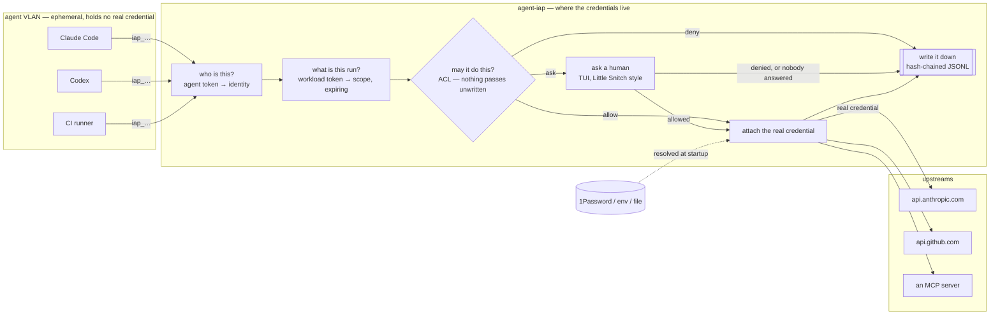
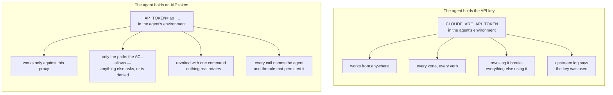

<p align="center">
  <picture>
    <source media="(prefers-color-scheme: dark)" srcset="assets/logo-dark.svg">
    
  </picture>
</p>

# agent-iap

[](https://github.com/vpetersson/agent-iap/actions/workflows/ci.yml)
[](https://github.com/vpetersson/agent-iap/releases/latest)

An identity-aware proxy for LLM agents.

**Give an agent access to an API or an MCP server without ever giving it the credential.**
Everything else here — the ACL, the interactive prompt, the tamper-evident audit
log — exists to make that grant narrow, observable and revocable.



The agent holds a token minted by the proxy. It is not an API key, it buys
nothing anywhere else, and revoking it rotates nothing. The real credential is
resolved from 1Password (or the environment, or a file) inside the proxy and
attached on the way out, after the policy has already said yes.

## Why this exists

The setup this was built for: agents run on a VLAN of their own, ephemeral, and
all they can reach is the internet, a model API and a dedicated GitHub account.
Nothing in that VLAN holds a credential worth stealing — which is exactly what
makes it safe to hand an agent a repository and let it work unattended.

That stops working the moment the task is not code. Build a report from Google
Analytics, check a setting in Cloudflare, pull numbers out of a third-party
dashboard, and the agent needs a credential for a system that was never part of
the arrangement. The two usual answers are both bad:

- **Paste the key into the agent.** It is now in an environment, a config file,
  a context window, and whatever got logged on the way past. It works from
  anywhere, it does everything that key can do, it lasts until a human remembers
  to rotate it, and the upstream's own audit log will tell you the key was used
  — not which agent used it. A prompt injection and a stolen laptop are the same
  event from the upstream's point of view.
- **Do it yourself.** The agent stops at the boundary and a human copies numbers
  between tabs, which is the work you were trying to hand over.

The missing piece is not a better vault. It is the answer to a narrower
question: *can this agent, right now, make this one call against this service* —
answered without the agent ever holding the thing that makes the call work.

### What the proxy changes

The same agent, before and after:



So a leaked agent context leaks a token whose entire power is the ACL, and the
blast radius of a compromised agent is that rule set rather than the API key's
own scope. [§ Security model](#security-model) is the same claim with its
limits attached.

### Where it sits

Little Snitch asks a human before an application is allowed to reach the
network. A secrets manager — 1Password, Vault, [OpenBao](https://openbao.org) —
decides who may *read* a credential. This is the join of the two: the secrets
manager's answer is resolved inside the proxy and never handed to the caller,
and the per-connection question Little Snitch asks gets asked per credentialed
call instead, with the answer written down.

It is not a secrets manager — it reads from yours. Not a firewall — allowing a
call is not opening the network, and the agent VLAN still needs its own rules.
Not a sandbox — it constrains what an agent can *reach*, never what it can
compute.

## Install

Every `v…` tag builds a binary for each platform, checksums it, and attaches it
to a GitHub Release — plus a container image on ghcr.io from the same bytes.

Homebrew, on macOS or Linux. The tap is this repository, so there is no second
`homebrew-` repo to keep in step:

```bash
brew tap vpetersson/agent-iap https://github.com/vpetersson/agent-iap
brew trust vpetersson/agent-iap   # Homebrew 7 loads no third-party formula until you do
brew install agent-iap
```

[`Formula/agent-iap.rb`](Formula/agent-iap.rb) installs the release tarball
against the sha256 that release published, so nothing is compiled; the release
workflow rewrites the formula from the checksums of the assets it just uploaded.
`brew install --HEAD agent-iap` builds master instead, and is the only form
there is before the first tag. `brew services start agent-iap` runs it as a
launchd or systemd service against `$(brew --prefix)/etc/agent-iap/iap.toml`,
with no approval console — see [§ Deployment](docs/deployment.md).

Or by hand:

```bash
# linux-x86_64 · linux-aarch64 · macos-arm64 · macos-x86_64
v=2026.9.1 platform=linux-x86_64
base=https://github.com/vpetersson/agent-iap/releases/download/v$v

curl -sSfLO "$base/agent-iap-$v-$platform.tar.gz"
curl -sSfLO "$base/SHA256SUMS"
sha256sum --ignore-missing -c SHA256SUMS     # macOS: shasum -a 256 -c

tar xzf "agent-iap-$v-$platform.tar.gz"
sudo install -m0755 "agent-iap-$v-$platform/agent-iap" /usr/local/bin/agent-iap
agent-iap --version
```

The Linux binaries are static musl: no glibc floor, no runtime to install
beside them, TLS roots compiled in. The macOS builds are not signed or
notarised — `curl` sets no quarantine attribute, but a binary downloaded through
a browser needs `xattr -d com.apple.quarantine agent-iap` first.

Or the image — the same binary on a distroless base, no shell and no package
manager:

```bash
docker run --rm ghcr.io/vpetersson/agent-iap:2026.9.1 --version
```

Tags are `2026.9.1`, the floating `2026.9` within a month, and `latest`, which
moves only when the tag being built really is the newest — so a backport does
not walk it backwards. There is no `2026` tag: the year is the major only
because semver needs one ([§ Versioning](docs/development.md#versioning)).
[§ Deployment](docs/deployment.md) has what to mount and what the image cannot
do.

With a Rust toolchain, from source:

```bash
cargo install --locked --git https://github.com/vpetersson/agent-iap
```

`cargo install agent-iap` does not work yet — nothing is published to
crates.io. The release workflow carries the job, dormant until a
`CARGO_REGISTRY_TOKEN` secret exists.

## Quickstart

Everything below writes `~/.config/agent-iap/iap.toml`: no root, nothing
installed anywhere — the proxy on a laptop, in front of one upstream.
[§ Deployment](docs/deployment.md) is the same thing as a daemon, and
[§ Where things live](docs/policy-file.md#where-things-live) has the full set of paths.

```bash
# 1. Write a policy file. No agents, no upstreams, and a fallthrough that asks
#    — it starts a proxy that grants nothing on its own, and mints no
#    credential you did not ask for.
agent-iap init

# 2. Say what it fronts, what is allowed, and who may ask. No editor.
agent-iap upstream add anthropic \
    --base-url https://api.anthropic.com \
    --auth header --header x-api-key --secret env:ANTHROPIC_API_KEY
agent-iap acl add --target anthropic \
    --methods POST --paths /v1/messages --action allow
agent-iap agent add claude-code --target anthropic
#    ^ prints the agent's token once, and copies it to your clipboard. Only
#      its sha256 goes in the file.

# 3. Check the policy and prove every credential reference resolves.
export ANTHROPIC_API_KEY=sk-...            # the key the proxy will inject
agent-iap check

# 4. Prove the other half: that Anthropic accepts that key.
agent-iap upstream verify anthropic --path /v1/models

# 5. See what the policy exposes, and to whom.
agent-iap list

# 6. Run it. On a terminal that is the approval console.
agent-iap run
```

Every command there found the policy file on its own. `--config` names another,
`IAP_CONFIG` names one for a whole shell, and a `./iap.toml` in the current
directory wins over the user-level file — so a repository or a demo can carry a
policy of its own.

Point the agent at the proxy:

```bash
export ANTHROPIC_BASE_URL=http://127.0.0.1:8080/anthropic
export ANTHROPIC_AUTH_TOKEN=iap_...        # the token from step 2, not your API key
```

Or, for an agent rather than an SDK, give it the proxy as an MCP server and let
it discover the rest — what it can reach, and how to call it, come back from the
policy itself. See [§ MCP](docs/mcp.md):

```json
{ "mcpServers": { "iap": {
    "type": "http",
    "url": "http://127.0.0.1:8080/_iap/mcp",
    "headers": { "Authorization": "Bearer iap_..." } } } }
```

Or hand it the address and the token and nothing else. `GET /` on the proxy
answers with what that agent can reach and how to call it, generated from the
policy — see [§ Zero state](docs/agents.md#zero-state):

```bash
export IAP_TOKEN=iap_...
export IAP_URL=http://127.0.0.1:8080
```

Step 6 is the part with a person in it. A call the policy will not decide on its
own waits on that terminal until somebody answers it, and the bottom pane is the
audit log as it is written
([§ The approval console](docs/console.md#the-approval-console)):

```
┌────────────────────────────────────────────────────────────────────────────────────────────────────────────┐
│ agent-iap   proxy 127.0.0.1:8080    1 waiting    1 agents · 1 upstreams · 0 mcp · 1 rules · default ask     │
└────────────────────────────────────────────────────────────────────────────────────────────────────────────┘
┌ waiting for you ───────────────────────────────┐┌ request ─────────────────────────────────────────────────┐
│▶    4s Claude Code github POST /repos/acme/api/││   agent  Claude Code (claude-code)                       │
│                                                ││    kind  http                                            │
│                                                ││  target  github                                          │
│                                                ││  method  POST                                            │
│                                                ││    path  /repos/acme/api/issues                          │
│                                                ││ waiting  4s                                              │
│                                                ││                                                          │
│                                                ││The credential is never shown to the agent — allowing only│
│                                                ││lets this one call through.                               │
└────────────────────────────────────────────────┘└──────────────────────────────────────────────────────────┘
┌ audit log (live) ──────────────────────────────────────────────────────────────────────────────────────────┐
│06:04:13 allow                  claude-code github GET /repos/acme/api → 200  [github-reads]                │
└────────────────────────────────────────────────────────────────────────────────────────────────────────────┘
┌────────────────────────────────────────────────────────────────────────────────────────────────────────────┐
│ ↑/↓  move   a  allow   A  allow for session   d  deny   D  deny for session   f  forget   q  quit           │
└────────────────────────────────────────────────────────────────────────────────────────────────────────────┘
```

## Documentation

[vpetersson.com/projects/agent-iap](https://vpetersson.com/projects/agent-iap/)
is the project's home page: what this is and why, without the flags. The
reference lives here, next to the code it describes.

| | |
| --- | --- |
| [Enrolment](docs/enrolling.md) | Putting a service in the file, proving it works, and taking it back out. |
| [Profiles](docs/profiles.md) | The services somebody has already worked out — their access levels, and what each one cannot reach. |
| [What happens to a request](docs/console.md) | The seven steps between an agent's call and the upstream's answer, and the console that answers the fifth. |
| [The policy file](docs/policy-file.md) | Every key it holds, the credential schemes, where the file lives, and what a reload replaces. |
| [TLS](docs/tls.md) | Getting the proxy off loopback — Tailscale, or a CA of your own. |
| [Agents](docs/agents.md) | Many agents on one proxy, workload tokens, and what an agent holding nothing but a token can find out. |
| [MCP](docs/mcp.md) | The gateway that makes this an MCP server, and the bridge that fronts somebody else's. |
| [The audit log](docs/audit-log.md) | The hash-chained record: what a line holds, and what it deliberately does not. |
| [Deployment](docs/deployment.md) | systemd, the container image, the file modes, and the control plane. |
| [Development](docs/development.md) | The test suite, what CI runs, and how a release is cut. |

## Security model

What this gives you:

- The agent never holds the upstream credential, so a leaked agent context, a
  prompt injection, or an exfiltrated config leaks a token that only works
  against this proxy, only for the paths the ACL allows, and that you can revoke
  with `agent-iap agent rm` — or replace with `agent-iap agent rotate` — without
  rotating anything real.
- With `workload_identity` on, what leaks is narrower still: a token scoped to
  one run's requests, expiring within the hour, revocable on its own, and
  detectably replayed if a second holder uses it.
- Every call is attributable to an agent, to the workload token it was made
  under, and to the rule that permitted it.
- The blast radius of a compromised agent is the ACL, not the API key's scope.
- When the answer is "stop everything", there is one: `--lockdown`, or `L` on
  the console, refuses every request without an edit, a reload or a restart,
  and cannot be lifted by anything that rewrites the policy file
  ([§ Stopping everything](docs/enrolling.md#stopping-everything)).
- No command grants anything by default, and no grant covers a service that was
  not in the file when it was written: an `allow` rule has to name the service
  it is about, `--any-target` being the blanket grant asked for by name, and
  `agent-iap check` lists the ones already written. `acl add` writes `ask`,
  `agent add` refuses to enrol an agent until it is told what that agent may
  reach, and an unmatched request falls through to `acl_default` — `ask` in the file
  `agent-iap init` writes and after an `acl reset`, `deny` after `acl reset
  --deny`, and never `allow` unless somebody wrote it there. An `ask` with
  nobody to ask denies, so nothing is waved through by a default either way;
  what changes is whether the refusal is visible. A policy where no rule says
  `ask` and `acl_default` does not either can never stop a request on a human,
  and `check`, `run` and the console all say so rather than leaving it to be
  inferred from a run of `<default>` lines in the audit log.

What it does not give you, and you should know before relying on it:

- **The stdio MCP bridge is not a process boundary.** The child holds the
  credential in its environment, and a same-user process can read that. It buys
  you policy and audit, not isolation. For a hard boundary, run the MCP server
  behind the daemon over HTTP, or in a container.
- **Both credentials are bearer tokens: possession is proof.** `[server.tls]`
  keeps them off the wire in cleartext, and workload identity shortens how long
  a stolen one is worth having and makes a second holder detectable. Neither
  binds a token to a channel, so anyone holding a copy is that agent for as long
  as it lives. That is what mTLS would buy, and it is not built yet.
- **Workload scopes are the agent's own declaration.** They narrow; they never
  widen. An agent that asks for everything it is entitled to has a token as broad
  as its ACL entry — short-lived and revocable, but not narrow. Treat it as
  defence in depth under the ACL, not as a replacement for writing one.
- **The ACL sees method, path and tool name, not intent.** It cannot tell a
  reasonable `POST /v1/messages` from an expensive one. Use `ask` where the
  distinction matters.
- **Response bodies are not inspected.** Nothing here stops an upstream from
  returning data the agent should not have.
- **`iap://` is a place to keep a credential, not a way to protect one.** The
  store is a `0600` file, not an encrypted vault: anything running as you can
  read it, and it is only as safe as the machine. It exists so a read-only token
  with no vault behind it can still go through the ACL and the audit log instead
  of being pasted into an agent's environment. Put anything that can spend money,
  or that you would have to rotate in a hurry, in `op://` or a real secret
  manager.
- Audit hash-chaining detects tampering by anyone who cannot rewrite the whole
  file; it is not an append-only store. Ship the lines somewhere else for that.

Found something that breaks one of the properties in the first list rather than
one of the limitations in the second? [`SECURITY.md`](SECURITY.md) has the
private reporting channel and what counts as in scope. Please don't open a
public issue — the tracker is world-readable, and a working description of how
to get past the ACL is a usable exploit against every deployment that has not
upgraded yet.

## Not built yet

Rate limits and spend caps per agent — that is what a fleet sharing one proxy
wants next, and [§ Multiple agents](docs/agents.md#multiple-agents) says what
it costs until then. Also: a decoupled TUI that attaches to an already-running
daemon over the control plane; SSE streaming for the HTTP MCP transport (single
JSON responses work, `data:` frames are parsed, long-lived streams are not);
mTLS agent identity, which is the missing half of
[§ Workload identity](docs/agents.md#workload-identity) — the token proves what
a run may do, and a client certificate is what would prove the run is still the
one holding it; per-workload ACL rules, so policy could name a workload label
and not just an agent; native 1Password Connect (the CLI is shelled out to
today). On service accounts specifically: only RSA keys are supported (Google
issues RS256 keys, so this covers Google), and the GCP metadata server and
workload identity federation are not wired up.

## License

MIT — see `LICENSE`.
