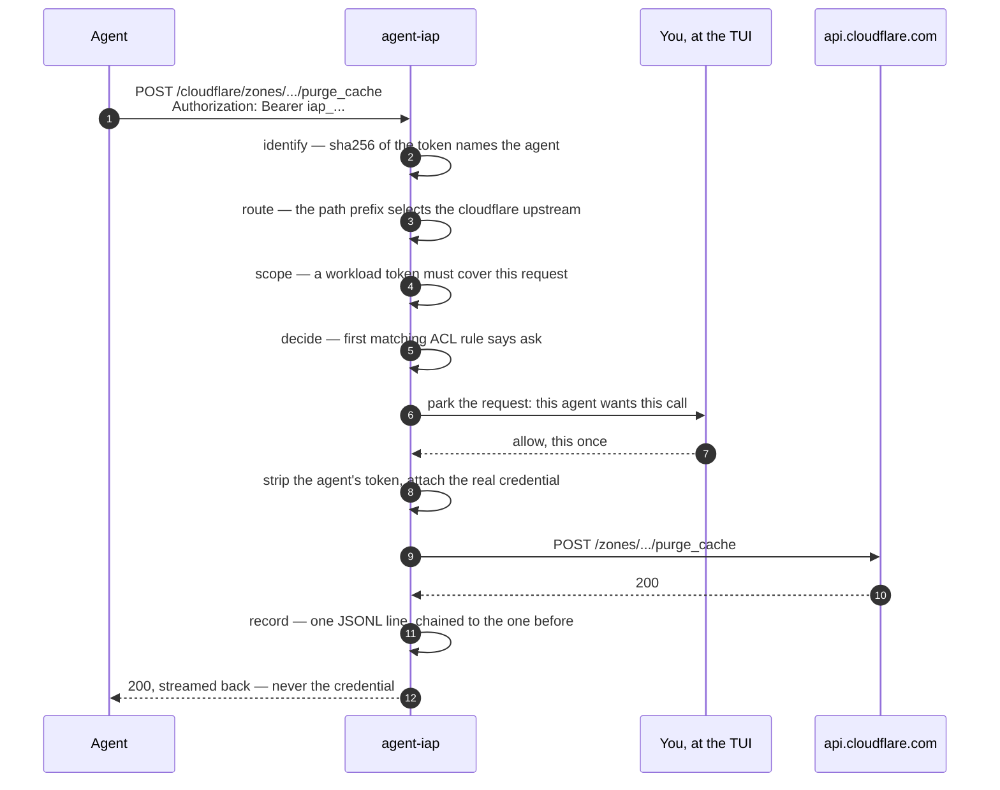

# What happens to a request



1. **Identify.** The agent sends `Authorization: Bearer <iap-token>` (or
`X-IAP-Token`). Only the token's sha256 is stored in the policy file. If it
sends a workload token instead — see
[§ Workload identity](agents.md#workload-identity) — that is checked, and it
also says what this particular run asked to be able to do.
2. **Route.** `POST /anthropic/v1/messages` selects the `anthropic` upstream and
   forwards `/v1/messages`. `X-IAP-Upstream: anthropic` does the same without a
   path prefix, for SDKs that will not take one.
3. **Scope.** A workload token covers a list of requests. Anything outside it is
   refused here, before policy is consulted at all.
4. **Decide.** The first matching ACL rule wins. Nothing matched means the
   default applies, and the default is `deny`.
5. **Ask, if the rule says so.** The request is parked and the operator answers
   it. A timeout, or no one watching the queue, denies.
6. **Inject.** The agent's own token is stripped. The real credential is added,
   and agent-iap appends itself to the `User-Agent` —
   `anthropic-sdk/0.39.0 agent-iap/2026.9.0 (+https://github.com/vpetersson/agent-iap)`.
   The upstream's own logs then show the SDK that made the call *and* the proxy
   that carried it; an upstream that pins its own `User-Agent` in
   `[[upstreams]].headers` still wins.
7. **Record.** One JSON line: who, what, which rule decided, the status, how long
   it took. Then the response is streamed straight back — token-by-token
   responses stay token-by-token.

## The approval console

`agent-iap run` *is* the console. Step 5 parks a request until a human answers
it, and the one thing that must never happen is parking it in a queue nobody is
watching — so `run` opens the console wherever there is a terminal to draw it
on, and no flag asks for it:

```bash
agent-iap run                             # the console, on a terminal
agent-iap run --no-tui                    # the log stream on stderr instead
agent-iap run --tui                       # insist, for a terminal we did not recognise
```

Where there is no terminal — a unit file, a container, a pipe into `tee` — `run`
is the log stream it has always been, so nothing deployed has to learn a flag.
What it gives up is the keyboard: unless something is polling the control plane,
an `ask` denies immediately rather than parking, and the startup banner says
which of the two you are getting.

**A parked request rings the terminal bell.** An `ask` that nobody answers
denies, so a console in a background window is a queue whose usefulness depends
on somebody happening to look at it — and a terminal you cannot see you can
still hear. What your terminal does with `BEL` is your setting rather than this
program's: a sound, a flashing window, a dock badge, a tmux window flagged with
`#{?window_bell_flag}`, a desktop notification from a terminal wired up that
way. A burst of parked requests is one ring rather than a dozen, since a dozen
beeps is a sound people turn off — and an agent retrying a call that is already
in the queue does not ring at all, because it is not a new question. Three ways
to say no:

```bash
agent-iap run --no-bell         # this run
export IAP_NO_BELL=1            # every run
```

```toml
[server]
approval_bell = false           # in the policy file, and reloadable
```

Nothing is rung at a terminal nobody is watching — a proxy under a unit file has
no business beeping at whoever started it.

The console owns the terminal, so diagnostics go to `agent-iap.log` beside the
audit log instead of to stdout, and the bottom pane is a live tail of the audit
log — what the agent has been doing while you decide what to allow next.

### The queue holds questions, not requests

An agent whose call is parked does not sit and wait for you: it retries, and
each retry is another request held on the same question. Those wait together.

```
┌ waiting for you ───────────────────────────────┐
│▶    21s ×6 Claude Code xai POST /v1/tts        │
└────────────────────────────────────────────────┘
```

One row, `×6` for the six calls behind it, and **one answer releases all of
them**. Six rows would be the same question asked six times, with five calls
timing out denied in the gaps between the answers — and a queue that scrolls,
on the screen whose whole job is to be readable at a glance.

Two requests are the same question when the ACL cannot tell them apart: same
agent, same kind, same target, same method, same path. That is everything a
rule matches on and everything a `Scope` can be narrowed to, so there is nothing
you could say about one of them that would not be equally true of the next.
**It is not the body.** Nothing in this proxy decides on a body, so two
`POST /v1/tts` calls carrying different text are one question here, exactly as
they are one rule, one scope and one remembered answer everywhere else. If you
need them told apart, they have to differ in the path.

A standing answer — "until quit", or a rule written by "5 min" / "from now on" —
also settles anything *else* already in the queue that it covers. Those requests
would have been waved through on arrival had they come in a second later;
leaving them parked would deny calls you just allowed, and nothing would raise
them again for you to notice.

A request whose agent hangs up leaves the queue with it, so the count is what is
actually waiting rather than what has ever arrived. `1 waiting · 6 requests` in
the header is the pair of numbers: questions to answer, calls held up by them.

### The dialogue

A parked request raises a dialogue of its own, unprompted: one sitting behind a
pane nobody is looking at will time out, and a timeout denies. It is Little
Snitch's dialogue, for Little Snitch's reason — "may this connect" is
unanswerable on its own, and what an operator *can* answer is may this agent do
this much, for how long.

```
┌ Claude Code is asking ───────────────────────────────────────┐
│  Claude Code  (claude-code)                                  │
│  wants to POST /repos/acme/api/issues on github              │
│  agent-iap holds the credential and attaches it on the way   │
│  out — allowing this does not hand it over.                  │
│                                                              │
│    Once   5 min   1 hour   1 day   Until quit   From now on  │
│                                                              │
│      ( ) anything on github                                  │
│      ( ) → POST on github                                    │
│      (•) → POST /repos/acme/api/issues on github             │
│                                                              │
│  writes an acl rule at #0, in front of                       │
│  `github-writes-need-a-human`, expiring at 10:41 on 14 Sep   │
│  — after that this asks again                                │
│                                                              │
│       d  Deny     a  Allow     esc  leave it waiting         │
└──────────────────────────────── waiting 4s ──────────────────┘
```

`←`/`→` picks how long, `↑`/`↓` picks how far, and the line above the buttons
says what the pair of them will do. All of it is clickable. The durations are
four different mechanisms:

- **Once** answers this request — and the identical ones waiting behind it, if
  the agent retried. The next call after that asks again.
- **5 min / 1 hour / 1 day** write an ACL rule that carries its own deadline.
  Past it the rule matches nothing and the request falls through to whatever is
  behind it — which, for a rule written in front of an `ask`, is the `ask`
  again.
- **Until quit** is remembered in this process, for everything the chosen row
  covers, and dies with it. The only answer that writes nothing.
- **From now on** writes the same rule without a deadline.

Everything that writes a rule writes it *in front of* the `ask` that raised the
question, because first match wins and an appended rule would sit behind it and
never be reached. All of them are live in this process immediately.

Most of what an operator wants to say is not "yes" and not "no" but *yes, while
I am doing this*; without a way to spell that, the choice is between a grant
that outlives its reason and being asked again in thirty seconds, and both end
with somebody holding the key down. The deadline lives in the file rather than
in this process's memory, so a restart does not hand the grant back and nothing
has to remember to take it away.

The cursor starts on the narrowest row and on `Once`, so the default hands out
no more than was asked for. `a`/`d` on the queue itself answer once, at that
scope, without opening anything.

**Every row names the service the request was for.** There used to be one above
them — "any request from Claude Code" — which wrote `target = "*"`, and so
turned an answer about one call into a standing grant over every service this
proxy would ever front: the next `upstream add` was allowed before anybody saw
it, and this queue stayed empty. The blanket grant is still available from the
command line, where it can be read back before it is written
(`agent-iap acl add --action allow --any-target`); what it is not is one
keystroke away from a question about GitHub.

### The other panes

`1`…`7` or `tab` move between them, and everything the enrolment commands do
from a shell is a form here, over the same functions with the same validation:

| Pane | What it shows | Keys |
| --- | --- | --- |
| approvals | the queue, and the request in full | `enter` `a` `d` `f` |
| agents | id, name, targets, where its token comes from | `n` enrol · `t` new token · `x` revoke |
| upstreams | base URL, scheme, credential reference, last verification | `n` add, from a profile or spelled out · `e` edit · `v` verify · `x` remove |
| mcp | transport, command or URL, credential references, last verification | `n` add · `v` verify · `x` remove |
| acl | every rule in match order, with its number and what is left of any deadline | `n` add · `x` remove · `R` reset to asking |
| credentials | every reference the file names, and whether it still resolves | `c` re-check |
| profiles | the ready-made service definitions | `enter` add |

`n` on the upstreams pane opens on the catalogue rather than on a blank form,
and the catalogue is the whole screen: which service this is decides every field
under it, and there are approaching sixty to choose from.

```
┌ pick a profile ────────────────────────────────────────────────────────┐
│ search: s▏                                                             │
│ S ▶ semrush                Semrush        Semrush API (v3)             │
│     semrush-trends         Semrush        Semrush Trends API           │
│     semrush-v4             Semrush        Semrush API (v4)             │
│     sentry                 Sentry         Sentry API (sentry.io)       │
│     sentry-self-hosted     Sentry         Sentry API (self-hosted)     │
│     slack                  Slack          Slack Web API                │
│     spotify                Spotify        Spotify Web API              │
│     stripe                 Stripe         Stripe API                   │
│ G   google-cloud-storage   Google         Google Cloud Storage         │
│     google-search-console  Google         Google Search Console        │
│     google-sheets          Google         Google Sheets                │
│                                                                        │
│ https://api.semrush.com  Domain, keyword and backlink reports.         │
│  ↑/↓  move   a–z  narrow   enter  pick   esc  clear what was typed     │
└ 11 of 25 ──────────────────────────────────────────────────────────────┘
```

**Typing narrows by what things are *called*.** `s` is every profile filed under
`s` — not the forty whose description happens to contain the letter — because a
needle matches at the start of a word: the id, each `-` separated part of it,
and each word of the vendor and the title. So `mcp` is every MCP profile at
once, spread through an alphabetical list as they are, and `analytics` is the
two Google ones. The ones whose *name* starts with what you typed come first
and the ones that merely have a word starting with it follow, which is why
`google-sheets` is under `stripe` above rather than missing. Only when nothing
is *called* what you typed does it look inside the descriptions instead, so
`sitemaps` still finds Search Console and nothing is unreachable. The list is alphabetical and the gutter carries each
initial once, which is what makes it a thing to read as well as a thing to
search.

Landing on a profile replaces the form with that profile's: no base URL to type,
no scheme to pick, its variables and access levels as named fields, and the
credential reference the only thing left to fill in. `esc` off the picker is the
hand-written form — *none* — for a service the catalogue does not have, and
`ctrl-o` on the `profile` field opens it again. Only the HTTP profiles are
offered here; an MCP profile belongs to the `mcp` pane.

Like the command, the form grants nothing: the switch that writes the access
level's rules is `grant now`, and it is off. Leave it off and the first call
arrives on the approvals pane of this same console.

`e` on an upstream — or `enter`, or a double-click — opens that entry rather
than a blank one: the base URL it has, the scheme it uses, the references it
names, ready to be corrected. Saving writes the entry in place, so the ACL rules
aimed at it and the agents scoped to it go on naming the same thing — which `x`
and `n` could not have managed between them, and why the name is not on the
form. No credential *value* is shown, because the file holds none: what is
prefilled is the reference.

Every field that takes a credential *reference* — `secret`, `username ref`,
`client secret`, `key file`, `private key` — will also go and find the file for
you. `ctrl-o` opens a picker: `enter` walks into a directory or chooses a file,
`←` goes back up, typing filters the listing, `esc` leaves the field as it was.
It opens wherever the half-typed path was headed — `file:/run/sec` starts in
`/run` — and on `$HOME` when the field says nothing about the filesystem. What
lands in the field is the reference rather than the bare path,
`file:/run/secrets/anthropic`. Dotted files and directories are listed like
anything else, since `~/.ssh`, `~/.config` and `.env` are nearly the whole
answer to where such a file is kept. Nothing is read: the picker lists names,
and the file is opened for the first time by the proxy resolving it.

`n` on the acl pane offers the names the file already holds. An ACL rule's
`agent` and `target` are the id of an enrolled agent and the name of an upstream
or an MCP server, written down a few lines further up the same file — and
nothing checks them: a rule aimed at `github-api` when the upstream is called
`github` is accepted, written and reloaded, and then matches nothing at all.
Behind `acl_default = deny` that is an agent refused by a policy which visibly
contains the rule that was supposed to let it through, and it is the one mistake
here with no symptom. So `ctrl-o` on either field lists what the file holds —
each name beside what it is, an agent's targets, an upstream's base URL, an MCP
server's command — and only what the rule's `kind` can actually match, since an
MCP server under `kind = "http"` is the same never-firing rule as a typo. Both
stay text fields: `*` and `claude-*` are legal values that no list can hold.

It answers the mouse. Click a tab to change pane, a row to select it, twice to
open it. The wheel scrolls the pane, and the scope list when the dialogue is up.
The footer's key hints are buttons. All of it ends in the handler the keyboard
uses, so a click can never grant what a keystroke could not.

Reporting the pointer stops the terminal's own text selection working, and the
thing most worth selecting off this screen is a token — so `m` turns it off and
back on, and most terminals let you hold ⇧ to select through it.

`L` is the panic button: it denies everything for as long as the proxy runs,
writes nothing, and the header says so in red until `L` again lifts it ([§
Stopping everything](enrolling.md#stopping-everything)). `R` on the rules pane
is the written-down start-over — every rule out, `acl_default` to `ask`, so
what those rules were deciding comes back to this console to be answered — and
it asks first, being the one key here that can delete a policy. Both are
shifted, because neither is something to reach by slipping off the key beside
it.

`?` lists the keys, and `q` quits the console and stops the proxy with it. `r`
re-reads the policy file, though it rarely has to: the file is watched, so an
`agent-iap acl add` in the next terminal, or a hand edit in an editor, lands in
the panes — and in the running proxy — on its own, and the footer says what
changed. A file caught mid-rewrite is waited on rather than reported as broken,
and a file edited into something that will not parse is reported once, with the
proxy left running the last policy that did ([§ Reloading](policy-file.md#reloading)).

`r` re-reads the credentials too, and it is the only thing in this console that
does — a rule you granted from the approval dialogue, or a form you just
submitted, reloads the policy and serves the credentials this process already
resolved ([§ Reloading](policy-file.md#reloading)). For `op://` references a
re-read is a vault round trip — one `op` for all of them, so one authorization
prompt rather than one each — and a standing answer to an `ask` names no
credential at all. So `r` runs off the drawing thread, as every reload does:
the keystroke comes back at once, the header says `re-reading the policy…`
while it is happening, and the panes follow when the proxy has the new policy
in charge. The answer you gave a waiting request never waits on any of it: that
goes straight to the agent holding the connection open.

`v` on an upstream or an MCP server calls it with the credential the file names,
and puts the answer in the row's `VERIFIED` column, the whole report in a modal
behind it. It runs off the drawing thread, because the console cannot stop
answering an `ask` while a vault wakes up. The add and edit forms carry the same
as a switch, on by default ([§ Verifying](enrolling.md#verifying)).

A minted token is shown once, in a modal, and then only its sha256 exists. No
credential *value* is ever displayed: the credentials pane shows references, and
`c` reads every one of them from its source again — not from what this process
is already holding — to answer the one question the file cannot: whether the
vault is still unlocked and the variable still set. That is a real read, so it
is a vault prompt if your vault prompts, and it runs off the drawing thread like
everything else here that consults a credential.

Everything written here is in force before you look away — rules, roster,
upstreams, MCP servers, credentials, timeouts, the audit log, and the address
this proxy listens on. Nothing the console writes waits for a restart
([§ Reloading](policy-file.md#reloading)).
